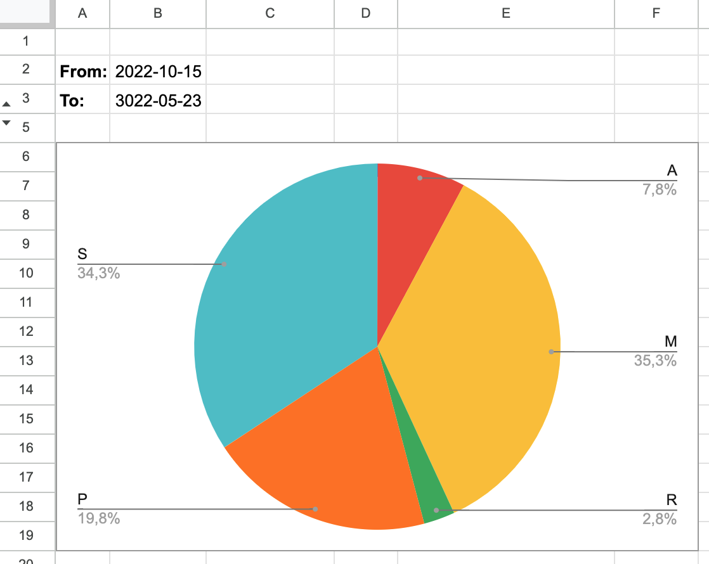

# Hello, :wave: I'm Marcin

I'm a Software Engineer with a need to learn and grow. And this profile exists to track and share my learning effort.
I use it to gather my side projects, which help me to practice new methodologies and technologies.
It's here for having fun and sharing fun with others.

> The difference between ordinary and extraordinary is practice
>
> -- [Vladimir Horowitz](https://en.wikipedia.org/wiki/Vladimir_Horowitz)

## About me
:astonished:

My journey as a software engineer started when I was a teenager.
I was in high school, [Upper-Secondary Schools of Communications](https://tl.krakow.pl/) and attended a course about programming AVR microcontrollers.
And I totally loved it since the first class. It was the moment when I realized what do I want to do for living and fun.
When I started college, [Cracow University of Technology](https://www.pk.edu.pl), Computer Science, I was sure I'll stay close to the hardware, programming low level (I loved Assembly!) and will never be a web developer.
When I graduated, I already worked full time as a web developer.

:seedling:

My professional career started in 2011 in [Sabre](https://www.sabre.com/).
I joined the team taking care of the rail bookings system.
I started as a QA intern and was very lucky to meet great people, mentors, who did a great job introducing me to the business.
They taught me to work hard and play hard, as social life is important for everyone, including software engineers.
They taught me that EnvironmentVariablesTable could probably be a better name for a Java class than MCTable (an abbreviation for Marcin Ciapa Table).
I worked 95% creating and maintaining automatic tests in Java/Groovy, with the support of TestNG.
I was testing Front end with Selenium and SOAP web services with Java HTTP client.
Performance tests with JMeter was also part of my job.
This QA's perspective I gained these days remains valuable today.
Thank you a lot, guys, for everything!

:bullettrain_side:

Half year later, in 2012 I continued my journey in Sabre Rail Team as a Java Developer. Still shy and inexperienced. Still with so much to learn.
I worked with Java codebase, SOAP web services, OSGi-bundled client application, GWT application. Well, it wasn't a modern technology stack, even for these days.
But the experience was priceless.
I learnt how to expose an API and how to consume it.
I learnt some UI development, struggling a lot with my lack of aesthetic sense.
I learnt logging and processing logs.
I learnt that I can swirl a tea with a fork.
I learnt.
Up to the moment I discovered it's time for changes.

:bar_chart:

In 2018, I joined [SmartRecruiters](https://www.smartrecruiters.com/), having that fresh experience of moving from tens of thousands headcount company to the startup hiring ~100 engineers.
I had an impression that I joined the elite, not being sure what am I doing among them. 
My learning curve went straight up again. Things looked so different in a small company: they were just happening!
Well, not by themselves, we made them happening.
It was a great experience to feel how impactful we are, just delivering software and seeing the result. Immediately! On production!
I joined a team responsible for search, analytics and reporting in the platform.
My technologies were mostly Java and a lot of databases (Postgres, Oracle, Amazon Redshift, Google BigQuery, Elasticsearch, Solr). 
We worked on the large datasets trying to make them run efficiently.
The DevOps technologies were Docker, Kubernetes, Jenkins. 
The data was replicated to secondary data stores using RabbitMQ messaging infrastructure.
I had a chance to work directly with customers, researching solutions, projects, features.
I liked a lot the culture of promoting contract tests for API-exposing microservices.
This job gave me the opportunity to wear different hats: Java developer, QA, DevOps, PM, coffee machine maintainer.

And here I am now. Still loving this feeling of joy when 'It works!' after adding yet another line of code.

## My skill set
| Skill           | Rate                                                                   |
|-----------------|------------------------------------------------------------------------|
| Java            | :green_circle::green_circle::green_circle::white_circle::white_circle: |
| Spring          | :green_circle::green_circle::green_circle::white_circle::white_circle: |
| Hibernate/JPA   | :green_circle::green_circle::green_circle::white_circle::white_circle: |
| Jooq            | :green_circle::green_circle::white_circle::white_circle::white_circle: |
| Postgres        | :green_circle::green_circle::green_circle::white_circle::white_circle: |
| Oracle          | :green_circle::green_circle::white_circle::white_circle::white_circle: |
| MongoDB         | :green_circle::white_circle::white_circle::white_circle::white_circle: |
| Elasticsearch   | :green_circle::green_circle::white_circle::white_circle::white_circle: |
| Solr            | :green_circle::green_circle::white_circle::white_circle::white_circle: |
| Amazon Redshift | :green_circle::green_circle::green_circle::white_circle::white_circle: |
| Google BigQuery | :green_circle::green_circle::white_circle::white_circle::white_circle: |
| RabbitMQ        | :green_circle::green_circle::white_circle::white_circle::white_circle: |
| Kubernetes      | :green_circle::green_circle::white_circle::white_circle::white_circle: |
| Docker          | :green_circle::green_circle::green_circle::white_circle::white_circle: |
| Linux           | :green_circle::green_circle::green_circle::white_circle::white_circle: |
| DDD             | :green_circle::green_circle::white_circle::white_circle::white_circle: |
| Angular         | :green_circle::white_circle::white_circle::white_circle::white_circle: |

## My projects

### ACTracker
The job of [ACTracker](https://int.cloud.equino.ovh/actracker-ui) is tracking daily activities.
It requires inserting activities, including their start and end time, to analyze and visualize them.
Activities have tags assigned to them to allow aggregating and analyzing them.
Screenshots below come from a simple spreadsheet doing more or less the same thing.

The system contains of following components
- [actracker-ui](https://github.com/marcinciapa/actracker-ui) - a frontend application responsible for presentation layer
- [actracker-api](https://github.com/marcinciapa/actracker-api) - a CRUD backend application responsible for handling clients' requests
- [actracker-search-feeder](https://github.com/marcinciapa/actracker-search-feeder) - an event consumer responsible for ingesting data to the search engine after they change

Applications and their infrastructure are deployed to [Equino Kubernetes](https://github.com/marcinciapa/equino-kubernetes) cluster.

Except functional part, the application is a sandbox to practice the software engineering techniques and technologies, like: DDD, persistence, messaging, Elasticsearch, Kubernetes, Angular.

### tutorials
The [repository](https://github.com/marcinciapa/tutorials) for exercises related to software engineering field, like practicing concepts learnt from books.

## My learnings
Here's the log of my learnings, divided by months. Feel free to spy me on my progress.
- [February 2024](monthly/2024/FEB/README.MD)
- [January 2024](monthly/2024/JAN/README.MD)
- [December 2023](monthly/2023/DEC/README.MD)
- [November 2023](monthly/2023/NOV/README.MD)
- [October 2023](monthly/2023/OCT/README.MD)
- [September 2023](monthly/2023/SEP/README.MD)
- [August 2023](monthly/2023/AUG/README.MD)
- [July 2023](monthly/2023/JUL/README.MD)
- [June 2023](monthly/2023/JUN/README.MD)
- [May 2023](monthly/2023/MAY/README.MD)
- [April 2023](monthly/2023/APR/README.MD)
- [March 2023](monthly/2023/MAR/README.MD)

###### [Archive](monthly/README.MD)
###### [Books](books/README.MD)
